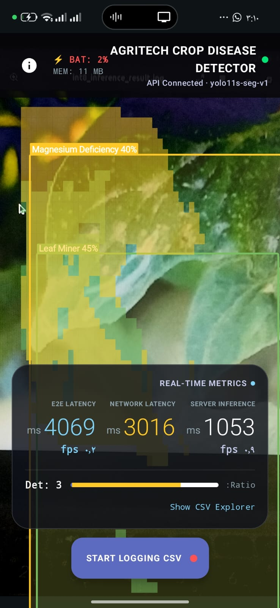
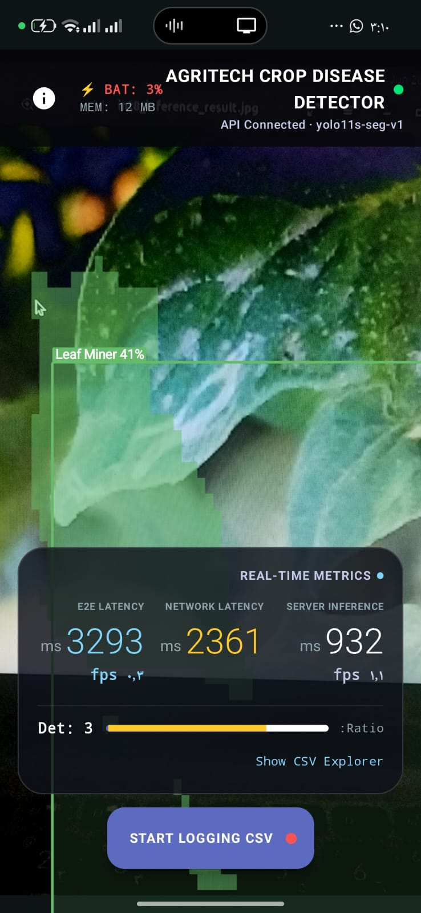
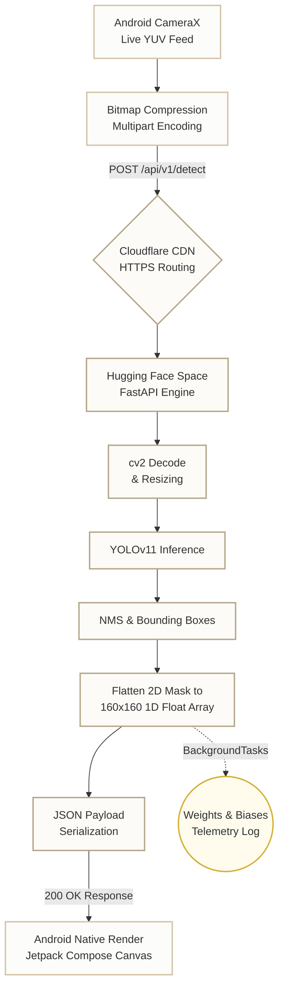
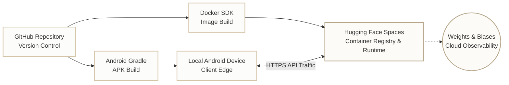
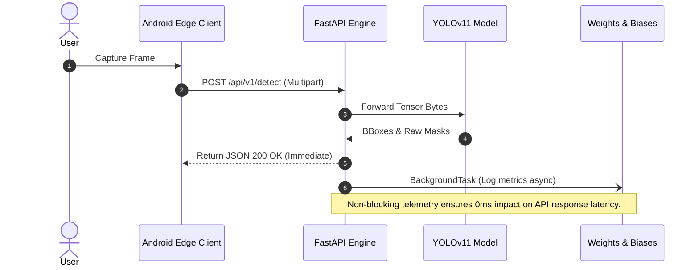

<div align="center">

# 🌿 AgriTech AI: Real-Time Crop Disease Segmentation Platform

### Democratizing Edge-AI: Real-Time Instance Segmentation & Agricultural Telemetry

**YOLOv11 Instance Segmentation** · **Jetpack Compose MVVM** · **FastAPI Asynchronous Inference** · **W&B MLOps**

[](https://kotlinlang.org)
[](https://developer.android.com/jetpack/compose)
[](https://fastapi.tiangolo.com)
[](https://ultralytics.com)
[](https://docker.com)
[](https://huggingface.co)
[](https://wandb.ai)
<br><br>[](https://drive.google.com/file/d/1RXlC0VfmuEW72bLMyflnj2H8zcnVUUXI/view?usp=sharing)

</div>

---

## 1. Philosophy & Vision

The **AgriTech AI Crop Disease Detector** represents a fundamental architectural pivot in how precision agriculture is delivered. Historically, executing state-of-the-art computer vision models—specifically YOLOv11 for pixel-perfect instance segmentation—demanded flagship mobile devices equipped with specialized Neural Processing Units (NPUs). Farmers with entry-level smartphones were left behind, plagued by out-of-memory errors, thermal throttling, and severe battery drain.

We solved this by **Democratizing Edge-AI**. This architecture aggressively decouples the mathematical violence of deep learning tensor operations from the mobile client. By offloading the dense matrix multiplications to a robust, containerized cloud backend, the mobile device is repurposed into a pure sensory node and a hyper-fast rendering engine.

When a farmer points their phone at a decaying leaf, the device compresses the viewport, dispatches a secure remote procedure call, and awaits a highly structured JSON geometry payload. The result is a buttery-smooth 60 FPS augmented reality interface, delivering zero-compromise precision agriculture to the very edge of the network, regardless of the user's hardware.

---

## 📱 App Showcase

<div align="center">
  
  &nbsp;
  
  <p><i>Live on-device rendering of YOLOv11 segmentation masks via Jetpack Compose Canvas.</i></p>
</div>

---

## 2. System Architecture

The following topological graph illustrates the complete lifecycle of a single camera frame from optical capture to inference and rendering.



### Infrastructure & Deployment Architecture

The system's physical and cloud deployment topology is structured to guarantee high availability and automated builds.



### Directory Structure

<details>
<summary>📂 Expand to view the deep repository architecture</summary>

```text
AgriTech-AI-Android/
│
├── app/                                 # Android Mobile Client
│   ├── build.gradle.kts                 # Kotlin DSL dependency management
│   └── src/main/java/com/aistudio/agritech/
│       ├── MainActivity.kt              # Root activity mapping the Compose UI
│       ├── viewmodel/
│       │   └── BenchmarkViewModel.kt    # MVVM: Orchestrates CameraX & Dispatchers.IO
│       ├── data/
│       │   ├── model/
│       │   │   └── Detection.kt         # Domain logic & CLASS_NAMES constant mapping
│       │   └── remote/
│       │       ├── ApiClient.kt         # Retrofit OkHttp Singleton instance
│       │       ├── ApiService.kt        # HTTP endpoint definitions
│       │       └── DetectionResponse.kt # Moshi JSON DTOs for strict schema validation
│       └── ui/
│           ├── components/
│           │   ├── CameraPreviewOverlay.kt # Live hardware lens rendering
│           │   └── DetectionOverlay.kt     # High-performance Canvas path drawing
│           └── theme/                   # Material3 design tokens
│
├── backend/                             # Python Cloud Inference API
│   ├── main.py                          # FastAPI routing, W&B hooks, BackgroundTasks
│   ├── schemas.py                       # Pydantic models for HTTP contracts
│   ├── requirements.txt                 # Dependencies (fastapi, ultralytics, wandb)
│   ├── Dockerfile                       # HF Spaces container runtime definition
│   └── weights/
│       └── best.pt                      # Serialized YOLOv11-seg model weights
│
├── .env.example                         # Environment variable template
└── README.md                            # Comprehensive Architectural Documentation
```
</details>

---

## 3. Core Methodology & AI Logic

*   **Image Processing Pipeline:** 
    The operation begins when Android's `CameraX` API extracts an `ImageProxy` frame from the hardware lens. To conquer unstable rural 3G/4G networks, the client applies a mathematically calibrated JPEG compression algorithm that aggressively reduces file size while preserving high-frequency edge gradients. This payload is dispatched over an OkHttp/Retrofit asynchronous stream, forced onto Kotlin's `Dispatchers.IO` pool to guarantee the main UI thread remains completely unblocked.

*   **YOLOv11 Segmentation Logic:** 
    On the server side, the byte stream is decoded via OpenCV and propelled through the YOLOv11 instance segmentation network. Following Non-Maximum Suppression (NMS) to eliminate overlapping artifacts, the two-dimensional boolean masks are mathematically flattened into a strictly 1-dimensional array of 25,600 floats (representing a 160x160 grid). This flattening mechanism is the key to bypassing JSON memory fragmentation and surviving network transit efficiently.

*   **Android Native Rendering:** 
    Upon receiving the payload, the client parses the 25,600 floats via Moshi and passes the data structure to `DetectionOverlay.kt`. Using Jetpack Compose's `Canvas` API, the flattened array is reconstructed, scaled relatively to the physical screen dimensions, and drawn as a native Android `Path` geometry. This results in a vivid, translucent AR polygon overlaid flawlessly onto the live camera feed at 60 FPS using coroutine decoupling.

---

## 4. API Reference

The communication contract between the Android edge client and the FastAPI inference engine is strictly enforced using Pydantic.

### `POST /api/v1/detect`
**Content-Type:** `multipart/form-data`

| Parameter | Type | Required | Description |
|-----------|------|----------|-------------|
| `image`   | File | Yes      | The compressed JPEG/PNG binary captured by the mobile lens. |

#### ✅ Success Response (200 OK)
<details>
<summary>Click to view exact JSON success schema</summary>

```json
{
  "detections": [
    {
      "class_id": 2,
      "class_name": "Pottassium Deficiency",
      "confidence": 0.8945,
      "box": [124.5, 89.2, 412.0, 310.5],
      "mask": [0.0, 0.0, 0.0, 1.0, 1.0, 1.0, "... (25,600 floats total)"]
    }
  ],
  "inference_ms": 112,
  "model_version": "yolo11s-seg-v1",
  "image_width": 640,
  "image_height": 480
}
```
</details>

#### ❌ Error Response (415 Unsupported Media Type)
<details>
<summary>Click to view JSON error schema</summary>

```json
{
  "detail": "Invalid file format. Only JPEG and PNG are supported."
}
```
</details>

---

## 5. Sequence Diagram: Asynchronous Telemetry

World-class MLOps requires unyielding observability. We integrated **Weights & Biases (W&B)** to actively monitor concept drift, confidence intervals, and inference latency spikes. To ensure telemetry logging never penalizes the API response time, the W&B logging function is injected asynchronously.



This sequence guarantees that the farmer receives the crop health diagnosis instantly, while the backend silently records statistical metadata in the background.

---

## 6. Overcoming Engineering Hurdles

Building an enterprise-grade cloud-edge system required solving several critical engineering bottlenecks.

| Challenge | Impact | Engineering Solution |
|-----------|--------|----------------------|
| **W&B Cold Start Crash** | App crashes immediately on boot if W&B servers are unreachable or the API key format is rejected. | Implemented protective environment variable guards and lazy initialization logic in `main.py`. If W&B fails to authenticate, it degrades gracefully to standard stdout logging, keeping the API 100% operational. |
| **404 Routing on HF Spaces** | Android requests returned 404 HTML pages because Hugging Face Spaces default to 'Private', blocking unauthenticated API calls. | Dynamically injected `BuildConfig.AGRITECH_API_URL` via Gradle Secrets. The Space visibility was toggled to Public, allowing clean, direct HTTPS traffic routing straight to the Uvicorn workers. |
| **Compose Recomposition Blocking** | Extracting massive arrays (25,600 elements) per frame caused the main UI thread to lock up, dropping the camera feed FPS. | Flattened the multi-dimensional arrays on the backend, decoupled the network layer using immutable states, and forced heavy geometry path recalculations strictly into `Dispatchers.Default` background threads. |

---

## 7. Setup & Execution

### 0. Quick Start: Pre-built APK
If you want to test the app immediately without building it from source, you can install the compiled Android APK directly:  
👉 **[Download AgriTech Benchmark APK](https://drive.google.com/file/d/1RXlC0VfmuEW72bLMyflnj2H8zcnVUUXI/view?usp=sharing)**

### 1. Clone the Repository
```bash
git clone https://github.com/HassanAhmed2Hassan/AGRITECH-YOLOv11-Benchmark.git
cd AGRITECH-YOLOv11-Benchmark
```

### 2. Run the FastAPI Engine Locally (Docker / Shell)
Boot the backend container using standard Python tools.
```bash
cd backend
pip install -r requirements.txt
uvicorn main:app --host 0.0.0.0 --port 8000 --reload
```

### 3. Configure the Mobile Environment
Configure your local API endpoints safely.
```bash
cp .env.example .env
```
Inside `.env`, define the exact URL:
```env
AGRITECH_API_URL=http://<YOUR_LOCAL_IP>:8000/api/v1/
# Or Hugging Face Space URL:
# AGRITECH_API_URL=https://your-space-name.hf.space/api/v1/
```

### 4. Build the Android APK
Compile the mobile client using the Gradle wrapper, injecting secrets directly into bytecode.
```bash
./gradlew assembleDebug
```

---

## 8. System Limitations & Known Trade-offs

1. **AR Sync Delay (Latency Desynchronization):** Because the YOLOv11 tensor operations are offloaded to the cloud to save mobile battery and memory, there is an inherent ~1.5-second network round-trip latency. While the Android UI renders at 60 FPS, the green segmentation masks drawn on the screen belong to a frame captured ~1.5 seconds ago. Quick camera movements will result in a visual desync.
2. **Cold Start Penalty:** The Hugging Face Spaces free tier suspends the container after periods of inactivity. The very first API request may take 10–15 seconds to awaken the server before returning to the steady ~1.5s latency state.
3. **Strict Connectivity Dependence:** Unlike edge-compute (on-device) models, this cloud-reliant architecture requires a stable 3G/4G/Wi-Fi connection. It will not function in offline agricultural dead-zones.

---

## 9. About the Developer

**Developer:** Hassan Ahmed Hassan Zaki  
**Title:** Bioinformatics & AI Student, Alexandria University  
**Interests:** Computer Vision, Precision Agriculture, MLOps, and AI for Healthcare & Sustainability.

* **LinkedIn:** [Hassan Ahmed](https://www.linkedin.com/in/hassan-ahmed2007/)
* **Portfolio:** [Hassan's Technical Portfolio](https://hassan-ahmed-portfolio.vercel.app/)

---
<div align="center">
  <sub>Built by <strong>Hassan Ahmed</strong> — Engineer, Bioinformatician, Architect</sub>
</div>
